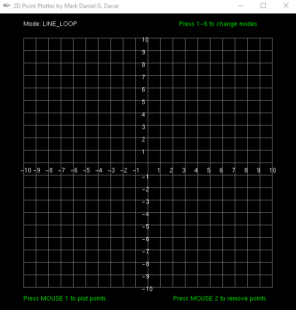

# GL 2D PLOTTER

**Author:** Mark Daniel G. Dacer  
**Date:** 9-11-2024

## Overview

GL 2D Plotter is a 2D plotting tool developed using OpenGL. It provides an interactive interface for users to plot and manipulate points on a grid. The program supports multiple drawing modes to visualize the points as different geometric shapes.

## Features

- **LINE_LOOP**: Connects points in a loop to form a polygonal shape.
- **TRIANGLES**: Connects points in groups of three to form triangles.
- **QUADS**: Connects points in groups of four to form quadrilaterals.
- **LINES**: Connects consecutive points with lines.
- **POINTS**: Displays individual points.
- **POLYGONS**: Connects all points to form a filled polygon.

## Controls

- **Add Points**: Left-click on the grid to plot points.
- **Remove Points**: Right-click on the grid to remove the closest point.
- **Change Drawing Mode**: Press keys `1` through `6` to switch between drawing modes:
  - `1`: LINE_LOOP
  - `2`: TRIANGLES
  - `3`: QUADS
  - `4`: LINES
  - `5`: POINTS
  - `6`: POLYGONS

## Requirements to run:

https://aka.ms/vs/17/release/vc_redist.x86.exe

https://aka.ms/vs/17/release/vc_redist.x64.exe
